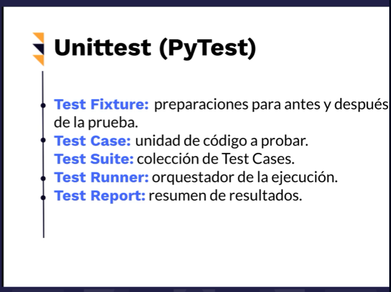

# Curso de Introducción a Selenium con Python

# **Modulo 1 : Comandos Básicos**



```python
import unittest
from pyunitreport import HTMLTestRunner
from selenium import webdriver

class HelloWorld(unittest.TestCase):

    #no se cierren las ventanas
    @classmethod
    def setUpClass(cls):
        cls.driver = webdriver.Chrome(executable_path = r'./chromedriver.exe')
        driver = cls.driver
        driver.implicitly_wait(10)

    def test_hello_world(self):
        driver = self.driver
        driver.get('https://www.platzi.com')

    def test_visit_wikipedia(self):
        self.driver.get('https://www.wikipedia.org')

    @classmethod
    def tearDown(cls):
        cls.driver.quit()

if __name__ == "__main__" :
    unittest.main(verbosity=2,testRunner=HTMLTestRunner(output='reportes',report_name='hello-world-report'))
```


Usualmente con selenium se sigue una prioridad para encontrar elementos.

En mi caso yo uso la siguiente.

- Id
- Name
- CSS selector o XPATH
- Link Text o PartialLinkText
- class

### Find element

```python
import unittest
from pyunitreport import HTMLTestRunner
from selenium import webdriver
from selenium.webdriver.common.by import By

class HomePageTests(unittest.TestCase):

    def setUp(self):
        self.driver = webdriver.Chrome(executable_path = r'./chromedriver.exe')
        driver = self.driver
        driver.get('http://demo-store.seleniumacademy.com/')
        driver.maximize_window()
        driver.implicitly_wait(15) #segundos

    def test_search_text_field(self):
        search_field = self.driver.find_element(By.ID, "search")

    def test_search_text_field_by_name(self):
        search_field = self.driver.find_element(By.NAME, "q")

    def test_search_text_field_by_class_name(self):
        search_field = self.driver.find_element(By.CLASS_NAME, "input-text")

    def search_button_enabled(self):
        button = self.driver.find_element(By.CLASS_NAME, "button")

    def test_count_of_promo_images(self):
        #div promos
        banner_list = self.driver.find_element(By.CLASS_NAME, "promos")
        banners = banner_list.find_elements(By.TAG_NAME, "img")
        #validaciones para ver si una condicion se cumple o no
        self.assertEqual(3, len(banners))

    def test_vip_promo(self):
        vip_promo = self.driver.find_element(By.XPATH, '//*[@id="top"]/body/div/div[2]/div[2]/div/div/div[2]/div[1]/ul/li[2]/a/img')

    def test_shoping_cart(self):
        shopping_cart_icon = self.driver.find_element(By.CSS_SELECTOR, 'div.header-minicart span.icon')

    def tearDown(self):
        self.driver.quit()

if __name__ == "__main__" :
    unittest.main(verbosity=2)
```


### asertions.py

```python
import unittest
from pyunitreport import HTMLTestRunner
from selenium import webdriver
from selenium.webdriver.common.by import By
from selenium.common.exceptions import NoSuchFrameException, NoSuchElementException

class Assertions(unittest.TestCase):

    def setUp(self):
        self.driver = webdriver.Chrome(executable_path = r'./chromedriver.exe')
        driver = self.driver
        driver.implicitly_wait(15) #segundos
        driver.maximize_window()
        driver.get('http://demo-store.seleniumacademy.com/')

    def test_search_field(self):
        self.assertTrue(self.is_element_present(By.NAME, 'q'))

    def test_language_option(self):
        self.assertTrue(self.is_element_present(By.ID, 'select-language'))

    def tearDown(self):
        self.driver.quit()

    #how es tipo
    #what es valor que tiene
    def is_element_present(self, how, what):
        try:
            self.driver.find_element(by=how, value=what)
        except NoSuchElementException as variable:
            return False
        return True

if __name__ == "__main__" :
    unittest.main(verbosity=2)
```

## smoketests.py

```python
from unittest import TestLoader, TestSuite
from pyunitreport import HTMLTestRunner
from assertions import Assertions
from searchtest import HomePageTests

assertions_test = TestLoader().loadTestsFromTestCase(Assertions);
search_test = TestLoader().loadTestsFromTestCase(HomePageTests);

smoke_test = TestSuite([assertions_test,search_test])

kwargs = {
    "output": 'smoke-report'
}

runner = HTMLTestRunner(**kwargs)
runner.run(smoke_test)
```

# ****Entender las clases WebDriver y WebElement****

**Selenium WebDriver** nos brinda la posibilidad de poder referirnos a estos elementos y ejecutar métodos específicos para realizar las mismas acciones que un humano haría sobre los mismos, gracias a las clases **WebDriver** y **WebElement**.

## Clase WebDriver

Cuenta con una serie de propiedades y métodos para interactuar directamente con la ventana del navegador y sus elementos relacionados, como son pop-ups o alerts. Por ahora nos centraremos a las más utilizadas.

## Propiedades de la clase WebDriver

Estas son las más comunes para acceder al navegador.

| Propiedad/Atributo | Descripción | Ejemplo |
| --- | --- | --- |
| current_url | Obtiene la URL del sitio en la que se encuentra el navegador | driver.get_url |
| current_window_handle | Obtiene la referencia que identifica a la ventana activa en ese momento | driver.current_window_handle |
| name | Obtiene el nombre del navegador subyacente para la instancia activa | http://driver.name/ |
| orientation | Obtiene la orientación actual del dispositivo móvil | driver.orientation |
| page_source | Obtiene el código fuente de disponible del sitio web | driver.page_source |
| title | Obtiene el valor de la etiqueta <title> del sitio web | driver.title |

## Clase WebElement

Esta clase nos permite interactuar específicamente con elementos de los sitios web como textbox, text area, button, radio button, checkbox, etc.

## Propiedades más comunes de la clase WebElement

| Propiedad/Atributo | Descripción | Ejemplo |
| --- | --- | --- |
| size | Obtiene el tamaño del elemento | login.size |
| tag_name | Obtiene el nombre de la etiqueta HTML del elemento | login.tag_name |
| text | Obtiene el texto del elemento | login.text |

## Métodos más comunes de la clase WebElement

| Método/Atributo | Descripción | Ejemplo |
| --- | --- | --- |
| clear() | Limpia el contenido de un textarea | first_name.clear() |
| click() | Hace clic en el elemento | send_button.click() |
| get_attribute(name) | Obtiene el valor del atributo de un elemento | submit_button.get_attribute(‘value’) last_name.get_attribute(max_length) |
| is_displayed() | Verifica si el elemento está a la vista al usuario | banner.is_displayed() |
| is_enabled() | Verifica si el elemento está habilitado | radio_button.is_enabled() |
| is_selected() | Verifica si el elemento está seleccionado, para el caso de checkbox o radio button | checkbox.is_selected() |
| send_keys(value) | Simula escribir o presionar teclas en un elemento | email_field.send_keys(‘team@platzi.com’) |
| submit() | Envía un formulario o confirmación en un text area | search_field.submit() |
| value_of_css_property(property_name) | Obtiene el valor de una propiedad CSS del elemento | header.value_of_css_property(‘background-color’) |
